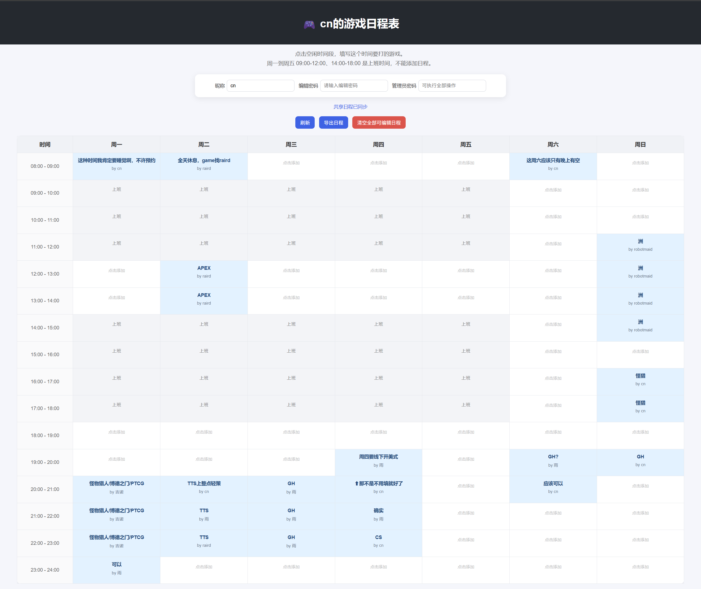

# Game Schedule Web

一个用于规划大家一起开游戏时间的多人共享游戏日程表。

当大家想一起打游戏时，经常会遇到“谁什么时候有空”“几点开始”“缺几个人”等问题。

因此做了一个网页版的共享日程表，让大家可以在同一个页面上添加自己想玩的游戏和时间段，从而更方便地协调开游戏的时间。

## 我自己的在线地址

[https://www.coni.top/game-schedule/](https://www.coni.top/game-schedule/)

## 示例截图



## 功能介绍

当前版本已经支持以下功能：

- 以一周日历的形式展示游戏日程
- 支持按小时添加游戏安排
- 支持多人共享查看同一个日程表
- 使用 MySQL 保存日程数据
- 支持用户昵称，方便知道是谁添加的日程
- 支持普通编辑密码
  - 可新增日程
  - 可修改日程
  - 可删除单个时间段日程
- 支持管理员密码
  - 可执行普通编辑密码的全部操作
  - 可清空全部可编辑日程
- 周一到周五工作时间不可添加日程
  - 09:00 - 12:00 不可添加
  - 12:00 - 14:00 午休时间，可以添加
  - 14:00 - 18:00 不可添加
- 支持手动刷新日程
- 支持自动同步日程
- 支持导出当前日程为文本文件

## 项目结构

```text
game-schedule-web/
├── img/
│   └── example.png
├── src/
│   ├── api.php
│   ├── config.example.php
│   ├── db.php
│   └── index.html
├── .gitignore
├── LICENSE
└── README.md
```

其中：

- `src/index.html`：前端页面
- `src/api.php`：后端接口
- `src/db.php`：数据库连接
- `src/config.example.php`：配置文件示例
- `src/config.php`：实际配置文件，需要自行创建，不应提交到 GitHub
- `img/example.png`：项目示例截图

## 部署说明

### 1. 克隆项目

```bash
git clone https://github.com/coni233/game-schedule-web.git
cd game-schedule-web
```

如果部署到服务器，可以将网站根目录指向：

```text
game-schedule-web/src
```

这样可以直接访问：

```text
https://你的域名/index.html
```

如果网站根目录不是 `src`，也可以通过类似下面的路径访问：

```text
https://你的域名/game-schedule/src/index.html
```

根据自己的服务器目录配置调整即可。

## MySQL 配置

### 1. 创建数据库
进入MySQL
```bash
mysql -u root -p
```

进入 MySQL 后执行：创建一个专门给游戏日程用的数据库

```sql
CREATE DATABASE game_schedule DEFAULT CHARACTER SET utf8mb4 COLLATE utf8mb4_unicode_ci;
```

进入数据库：

```sql
USE game_schedule;
```

### 2. 创建数据表

```sql
CREATE TABLE game_schedule_slots (
  id INT AUTO_INCREMENT PRIMARY KEY,
  slot_id VARCHAR(50) NOT NULL UNIQUE,
  day_name VARCHAR(10) NOT NULL,
  day_index TINYINT NOT NULL,
  hour TINYINT NOT NULL,
  game VARCHAR(50) NOT NULL,
  nickname VARCHAR(20) NOT NULL DEFAULT '匿名玩家',
  updated_at TIMESTAMP DEFAULT CURRENT_TIMESTAMP ON UPDATE CURRENT_TIMESTAMP
) ENGINE=InnoDB DEFAULT CHARSET=utf8mb4;
```

检查表是否创建成功：

```sql
SHOW TABLES;
```

如果看到：

```text
game_schedule_slots
```

说明创建成功。

### 3. 创建网站专用 MySQL 用户

不建议让网站直接使用 MySQL 的 `root` 用户。

可以创建一个专门给该项目使用的数据库用户：

```sql
CREATE USER 'game_user'@'localhost' IDENTIFIED BY '这里换成你的强密码';

GRANT SELECT, INSERT, UPDATE, DELETE ON game_schedule.* TO 'game_user'@'localhost';

FLUSH PRIVILEGES;
```

如果用户已经存在，可以使用：

```sql
ALTER USER 'game_user'@'localhost' IDENTIFIED BY '新的强密码';

GRANT SELECT, INSERT, UPDATE, DELETE ON game_schedule.* TO 'game_user'@'localhost';

FLUSH PRIVILEGES;
```

## 项目配置

复制示例配置文件：

```bash
cd src
cp config.example.php config.php
```

然后编辑 `config.php`：

```php
<?php
return [
    "db_host" => "localhost",
    "db_name" => "game_schedule",
    "db_user" => "game_user",
    "db_password" => "这里填写数据库密码",

    "edit_password" => "这里填写网页编辑密码",
    "admin_password" => "这里填写管理员密码"
];
```

配置说明：

- `db_host`：数据库地址，一般为 `localhost`
- `db_name`：数据库名
- `db_user`：数据库用户名
- `db_password`：数据库密码
- `edit_password`：普通编辑密码
- `admin_password`：管理员密码

建议：

- 普通编辑密码和管理员密码不要设置成一样
- 不要把真实的 `config.php` 上传到 GitHub
- `.gitignore` 中应包含：

```gitignore
src/config.php
config.php
```

## 权限说明

当前权限设计如下：

| 操作 | 普通编辑密码 | 管理员密码 |
| --- | --- | --- |
| 新增日程 | 可以 | 可以 |
| 修改日程 | 可以 | 可以 |
| 删除单个日程 | 可以 | 可以 |
| 清空全部可编辑日程 | 不可以 | 可以 |

## 工作时间规则

当前默认规则为：

| 时间 | 周一至周五 | 周六、周日 |
| --- | --- | --- |
| 08:00 - 09:00 | 可以添加 | 可以添加 |
| 09:00 - 12:00 | 上班，不可添加 | 可以添加 |
| 12:00 - 14:00 | 午休，可以添加 | 可以添加 |
| 14:00 - 18:00 | 上班，不可添加 | 可以添加 |
| 18:00 - 24:00 | 可以添加 | 可以添加 |

如果需要修改工作时间规则，可以调整 `src/index.html` 和 `src/api.php` 中的 `isWorkTime` 判断逻辑。

## 使用方式

1. 打开网页。
2. 输入自己的昵称。
3. 输入普通编辑密码或管理员密码。
4. 点击可以添加日程的时间格。
5. 输入想玩的游戏名称。
6. 其他人刷新或等待自动同步后，即可看到更新后的日程。

如果想删除某个时间段的日程，可以点击该时间格，然后将游戏名称清空并确认。

## 更新部署

本地修改代码后：

```bash
git add .
git commit -m "feat: update schedule feature"
git push
```

服务器更新代码：

```bash
cd /path/to/game-schedule-web
git pull
```

注意：服务器上的 `src/config.php` 不应由 Git 管理，需要保留在服务器本地。

## 未来计划

后续可能会增加以下功能：

### “我也要来”功能

用户可以对某个游戏日程表示自己也想参加。

例如某个时间段有人创建了 `APEX` 日程，其他人可以点击“我也要来”，将自己加入参与列表。

### “我这时有空”功能

用户可以标记自己在某个时间段有空，方便其他人发起游戏安排。

例如：

- 周五 20:00 - 22:00 有空
- 周六下午有空
- 周日晚上有空

这样大家可以更方便地找到共同空闲时间。

### 募集人数功能

创建日程时可以设置需要募集的人数或角色。

例如：

- 还差 1 人
- 还差 2 人
- 满 5 人开
- 缺坦克
- 缺奶
- 缺输出

这样日程表不只是记录“玩什么”，也可以记录“还差谁”。

### 报名列表

每个日程可以显示已经报名的人。

例如：

```text
APEX
已报名：cn、raid、robotmaid
还差：1 人
```

### QQ Bot 联动

未来可以和 QQ Bot 联动。

当某个时间段募集人数不足时，可以自动在 QQ 群里提醒或 @ 相关成员。

例如：

```text
今晚 20:00 有人开 APEX，还差 1 人，有空的来！
```

也可以在人数满足条件时自动通知：

```text
APEX 人齐了，今晚 20:00 开。
```

### 邮件通知

除了 QQ Bot，也可以增加邮件通知功能。

当有人发起游戏邀请、有人报名、人数满足开车条件时，可以自动发送邮件通知相关成员。

### 确认机制

用户收到邀请后，可以进行确认。

确认后，日程表自动更新参与状态。

例如：

| 用户 | 状态 |
| --- | --- |
| cn | 已确认 |
| raid | 已确认 |
| robotmaid | 待确认 |

### 更细粒度的权限管理

后续可以增加更完整的用户权限系统。

例如：

- 普通用户只能修改自己添加的日程
- 管理员可以修改所有日程
- 管理员可以清空全部日程
- 可以查看操作记录

### 操作记录

记录谁在什么时候新增、修改、删除了日程。

例如：

```text
2026-01-01 20:00 cn 添加了 周五 21:00 - 22:00 的 APEX 日程
2026-01-01 20:05 raid 修改了 周六 20:00 - 21:00 的游戏名称
```

这样可以方便排查误操作，也更适合多人协作。


