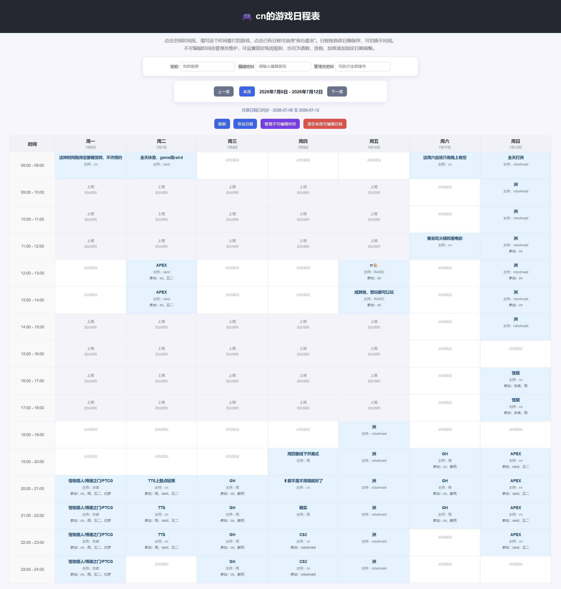

# Game Schedule Web

> **Version 2.0**
>
> 一个支持具体日期、参与报名和可配置不可编辑时间的多人共享游戏日程表。

当大家想一起打游戏时，经常会遇到“谁什么时候有空”“几点开始”“缺几个人”“谁也要来”等问题。

该网页版共享日程表可以让大家在同一个页面上添加想玩的游戏和时间段，也可以对已有日程标记“我也要来”，从而更方便地协调大家一起开游戏的时间。

## 我的在线地址

[https://www.coni.top/game-schedule/](https://www.coni.top/game-schedule/)

## 示例截图



## v2.0 新增功能

v2.0 将原本按固定星期保存的周表升级为按具体日期保存的日程表，并增加了可配置的不可编辑时间管理功能。

- 支持按照具体日期保存日程
- 支持查看上一周、本周和下一周
- 支持不同周之间分别保存游戏安排
- 支持管理员维护不可编辑时间
- 支持设置每周重复的固定规则
- 支持针对指定日期添加临时调整
- 支持“不可编辑”和“允许编辑”两种日期调整
- 支持为时间规则填写原因，例如：
  - 上班
  - 开会
  - 加班
  - 外出
  - 请假
  - 放假
- 支持使用请假或放假规则覆盖固定上班时间
- 前端和后端都会验证当前时间段是否允许编辑

## 功能介绍

当前版本已经支持以下功能：

### 日程管理

- 以一周日历的形式展示游戏日程
- 每一列同时显示星期与具体日期
- 支持按小时添加游戏安排
- 支持切换上一周、本周和下一周
- 不同日期的日程分别保存
- 支持多人共享查看同一个日程表
- 使用 MySQL 保存日程数据
- 支持手动刷新日程
- 支持定时自动同步日程

### 主持人与参与者

- 支持用户昵称
- 支持显示每个日程的主持人
- 支持“我也要来”功能
  - 点击已有日程后，可以勾选“我也要来”
  - 勾选后，当前昵称会显示在参与者列表中
  - 取消勾选后，可以退出该日程
- 支持在日程格中显示参与者列表

### 导出功能

支持将当前查看的一周导出为文本文件。

导出内容包括：

- 具体日期
- 星期
- 时间段
- 游戏名称
- 主持人
- 参与者

### 普通编辑密码

普通编辑密码可以执行：

- 新增日程
- 修改日程
- 删除单个时间段的日程
- 加入已有日程
- 退出已有日程

### 管理员密码

管理员密码拥有普通编辑密码的全部权限，并且还可以：

- 清空当前周全部可编辑日程
- 打开不可编辑时间管理页面
- 新增、删除固定每周规则
- 新增、删除指定日期调整
- 管理请假、放假、加班等特殊情况

## 不可编辑时间规则

v2.0 使用两级时间规则。

### 固定每周规则

固定规则会在每周重复生效。

默认规则为：

| 星期 | 时间 | 原因 |
| --- | --- | --- |
| 周一至周五 | 09:00 - 12:00 | 上班 |
| 周一至周五 | 14:00 - 18:00 | 上班 |

默认情况下：

| 时间 | 周一至周五 | 周六、周日 |
| --- | --- | --- |
| 08:00 - 09:00 | 可以添加 | 可以添加 |
| 09:00 - 12:00 | 上班，不可添加 | 可以添加 |
| 12:00 - 14:00 | 午休，可以添加 | 可以添加 |
| 14:00 - 18:00 | 上班，不可添加 | 可以添加 |
| 18:00 - 24:00 | 可以添加 | 可以添加 |

管理员可以在管理页面中增加或删除固定规则，不需要再修改 `index.html` 或 `api.php`。

### 指定日期调整

指定日期调整只对某一天生效，并优先于固定每周规则。

支持两种调整类型：

| 类型 | 作用 |
| --- | --- |
| `block` | 临时设为不可编辑 |
| `allow` | 临时设为可以编辑 |

使用示例：

- 请假：将原本的上班时间临时设为可以编辑
- 放假：将当天部分或全部时间设为可以编辑
- 临时加班：将原本可以编辑的时间设为不可编辑
- 开会：将指定时间设为不可编辑
- 外出：将指定时间设为不可编辑

例如：

```text
2026-07-18 09:00 - 18:00
类型：允许编辑
原因：请假
```

或者：

```text
2026-07-19 18:00 - 21:00
类型：不可编辑
原因：临时加班
```

## 项目结构

```text
game-schedule-web/
├── img/
│   └── example.png
│   └── example_v2.0.png
├── src/
│   ├── api.php
│   ├── config.example.php
│   ├── db.php
│   ├── index.html
│   ├── unavailable.html
│   └── config.php
├── .gitignore
├── LICENSE
└── README.md
```

其中：

- `src/index.html`：主日程页面
- `src/unavailable.html`：不可编辑时间管理页面
- `src/api.php`：后端 API 接口
- `src/db.php`：数据库连接
- `src/config.example.php`：配置文件示例
- `src/config.php`：真实配置文件，需要自行创建，不应提交到 GitHub
- `img/example.png` `example_v2.0.png`：项目示例截图

## 技术栈

- HTML
- CSS
- JavaScript
- PHP
- MySQL
- PDO

## 环境要求

建议环境：

- PHP 7.0 或更高版本
- MySQL 5.7 或更高版本
- Apache 或 Nginx
- PHP PDO MySQL 扩展
- 支持 HTTPS 的网站环境

检查 PHP 是否安装 PDO MySQL：

```bash
php -m | grep -E "PDO|pdo_mysql|mysql"
```

检查 PHP 文件语法：

```bash
php -l src/api.php
php -l src/db.php
php -l src/config.php
```

## 部署说明

### 1. 克隆项目

```bash
git clone https://github.com/coni233/game-schedule-web.git
cd game-schedule-web
```

如果部署到服务器，可以将网站根目录指向：

```text
game-schedule-web/src
```

这样可以直接访问：

```text
https://你的域名/index.html
```

如果网站根目录不是 `src`，也可以通过类似下面的路径访问：

```text
https://你的域名/game-schedule/src/index.html
```

请根据自己的服务器目录配置进行调整。

## MySQL 配置

### 1. 进入 MySQL

```bash
mysql -u root -p
```

输入 MySQL 密码后进入 MySQL。

### 2. 创建数据库

进入 MySQL 后执行，创建一个专门给游戏日程使用的数据库：

```sql
CREATE DATABASE game_schedule
DEFAULT CHARACTER SET utf8mb4
COLLATE utf8mb4_unicode_ci;
```

进入数据库：

```sql
USE game_schedule;
```

## 创建数据表

v2.0 共使用四张数据表：

```text
game_schedule_slots
game_schedule_participants
game_schedule_weekly_blocks
game_schedule_date_overrides
```

### 1. 创建日程表

`game_schedule_slots` 用于保存具体日期下的游戏日程。

```sql
CREATE TABLE game_schedule_slots (
  id INT AUTO_INCREMENT PRIMARY KEY,
  slot_id VARCHAR(50) NOT NULL UNIQUE,
  schedule_date DATE NOT NULL,
  day_name VARCHAR(10) NOT NULL,
  day_index TINYINT NOT NULL,
  hour TINYINT NOT NULL,
  game VARCHAR(50) NOT NULL,
  nickname VARCHAR(20) NOT NULL DEFAULT '匿名玩家',
  updated_at TIMESTAMP DEFAULT CURRENT_TIMESTAMP
    ON UPDATE CURRENT_TIMESTAMP,
  INDEX idx_schedule_date (schedule_date)
) ENGINE=InnoDB DEFAULT CHARSET=utf8mb4;
```

`slot_id` 用于唯一标识某一天的某个时间段。

`v2.0` 中的日程按照 `schedule_date` 保存，因此不同周的同一个星期和时间不会互相覆盖。

### 2. 创建参与者表

`game_schedule_participants` 用于保存某个日程的参与者。

```sql
CREATE TABLE game_schedule_participants (
  id INT AUTO_INCREMENT PRIMARY KEY,
  slot_id VARCHAR(50) NOT NULL,
  nickname VARCHAR(20) NOT NULL,
  created_at TIMESTAMP DEFAULT CURRENT_TIMESTAMP,
  UNIQUE KEY uniq_slot_nickname (slot_id, nickname),
  CONSTRAINT fk_participants_slot
    FOREIGN KEY (slot_id)
    REFERENCES game_schedule_slots(slot_id)
    ON DELETE CASCADE
    ON UPDATE CASCADE
) ENGINE=InnoDB DEFAULT CHARSET=utf8mb4;
```

这里使用了外键关联：

- 删除日程时，对应参与者会自动删除
- 同一个昵称不能重复加入同一个日程

### 3. 创建固定每周规则表

`game_schedule_weekly_blocks` 用于保存每周重复生效的不可编辑时间。

```sql
CREATE TABLE game_schedule_weekly_blocks (
  id INT AUTO_INCREMENT PRIMARY KEY,
  day_index TINYINT NOT NULL,
  start_hour TINYINT NOT NULL,
  end_hour TINYINT NOT NULL,
  reason VARCHAR(50) NOT NULL DEFAULT '不可编辑',
  created_at TIMESTAMP DEFAULT CURRENT_TIMESTAMP,
  updated_at TIMESTAMP DEFAULT CURRENT_TIMESTAMP
    ON UPDATE CURRENT_TIMESTAMP,
  INDEX idx_weekly_block_day (day_index)
) ENGINE=InnoDB DEFAULT CHARSET=utf8mb4;
```

星期对应关系：

```text
0 = 周一
1 = 周二
2 = 周三
3 = 周四
4 = 周五
5 = 周六
6 = 周日
```

### 4. 创建指定日期调整表

`game_schedule_date_overrides` 用于保存请假、放假、临时加班等指定日期规则。

```sql
CREATE TABLE game_schedule_date_overrides (
  id INT AUTO_INCREMENT PRIMARY KEY,
  override_date DATE NOT NULL,
  start_hour TINYINT NOT NULL,
  end_hour TINYINT NOT NULL,
  override_type ENUM('block', 'allow') NOT NULL,
  reason VARCHAR(50) NOT NULL,
  created_at TIMESTAMP DEFAULT CURRENT_TIMESTAMP,
  updated_at TIMESTAMP DEFAULT CURRENT_TIMESTAMP
    ON UPDATE CURRENT_TIMESTAMP,
  INDEX idx_override_date (override_date)
) ENGINE=InnoDB DEFAULT CHARSET=utf8mb4;
```

### 5. 初始化默认上班规则

```sql
INSERT INTO game_schedule_weekly_blocks
  (day_index, start_hour, end_hour, reason)
VALUES
  (0, 9, 12, '上班'),
  (0, 14, 18, '上班'),
  (1, 9, 12, '上班'),
  (1, 14, 18, '上班'),
  (2, 9, 12, '上班'),
  (2, 14, 18, '上班'),
  (3, 9, 12, '上班'),
  (3, 14, 18, '上班'),
  (4, 9, 12, '上班'),
  (4, 14, 18, '上班');
```

### 6. 检查数据表

```sql
SHOW TABLES;
```

应当看到：

```text
game_schedule_date_overrides
game_schedule_participants
game_schedule_slots
game_schedule_weekly_blocks
```

检查默认规则：

```sql
SELECT * FROM game_schedule_weekly_blocks
ORDER BY day_index, start_hour;
```

检查指定日期调整：

```sql
SELECT * FROM game_schedule_date_overrides
ORDER BY override_date, start_hour;
```

如果还没有添加临时调整，返回：

```text
Empty set
```

属于正常情况。

## 创建网站专用 MySQL 用户

不建议让网站直接使用 MySQL 的 `root` 用户。

创建专用用户：

```sql
CREATE USER 'game_user'@'localhost'
IDENTIFIED BY '这里换成你的强密码';

GRANT SELECT, INSERT, UPDATE, DELETE
ON game_schedule.*
TO 'game_user'@'localhost';

FLUSH PRIVILEGES;
```

如果用户已经存在：

```sql
ALTER USER 'game_user'@'localhost'
IDENTIFIED BY '新的强密码';

GRANT SELECT, INSERT, UPDATE, DELETE
ON game_schedule.*
TO 'game_user'@'localhost';

FLUSH PRIVILEGES;
```

## 从 v1.0 升级到 v2.0

v1.0 的日程只区分星期和小时，没有保存具体日期。

由于旧数据无法准确判断属于哪一周，升级前建议先备份数据库，再根据实际情况选择是否清空旧日程。

### 1. 备份数据库

```bash
mysqldump -u root -p game_schedule > game_schedule_v1_backup.sql
```

### 2. 进入数据库

```sql
USE game_schedule;
```

### 3. 清空旧日程

如果旧日程不需要保留：

```sql
DELETE FROM game_schedule_slots;
```

参与者记录会通过外键自动删除。

### 4. 为日程表增加日期字段

```sql
ALTER TABLE game_schedule_slots
ADD COLUMN schedule_date DATE NULL AFTER slot_id;
```

在确认旧数据已清理后，将字段改为必填：

```sql
ALTER TABLE game_schedule_slots
MODIFY COLUMN schedule_date DATE NOT NULL;
```

增加日期索引：

```sql
ALTER TABLE game_schedule_slots
ADD INDEX idx_schedule_date (schedule_date);
```

### 5. 创建 v2.0 新增的数据表

执行前文中的：

```text
game_schedule_weekly_blocks
game_schedule_date_overrides
```

两张表的建表语句。

### 6. 初始化默认规则

执行前文中的默认上班规则插入语句。

## 项目配置

复制示例配置文件：

```bash
cd src
cp config.example.php config.php
```

然后编辑 `config.php`：

```php
<?php
return [
    "db_host" => "localhost",
    "db_name" => "game_schedule",
    "db_user" => "game_user",
    "db_password" => "这里填写数据库密码",

    "edit_password" => "这里填写网页编辑密码",
    "admin_password" => "这里填写管理员密码"
];
```

配置说明：

- `db_host`：数据库地址，一般为 `localhost`
- `db_name`：数据库名称
- `db_user`：数据库用户名
- `db_password`：数据库密码
- `edit_password`：普通编辑密码
- `admin_password`：管理员密码

安全建议：

- 普通编辑密码和管理员密码不要相同
- 使用足够长且不容易猜到的密码
- 不要把真实的 `config.php` 上传到公开仓库
- 不要在前端 JavaScript 中写入真实密码
- 生产环境建议使用 HTTPS

`.gitignore` 中应包含：

```gitignore
src/config.php
```

服务器上的 `src/config.php` 不应由 Git 管理，需要保留在服务器本地。

## 权限说明

| 操作 | 普通编辑密码 | 管理员密码 |
| --- | --- | --- |
| 查看日程 | 不需要 | 不需要 |
| 新增日程 | 可以 | 可以 |
| 修改日程 | 可以 | 可以 |
| 删除单个日程 | 可以 | 可以 |
| 加入已有日程 | 可以 | 可以 |
| 退出已有日程 | 可以 | 可以 |
| 清空当前周可编辑日程 | 不可以 | 可以 |
| 查看不可编辑规则 | 不可以 | 可以 |
| 新增固定每周规则 | 不可以 | 可以 |
| 删除固定每周规则 | 不可以 | 可以 |
| 新增指定日期调整 | 不可以 | 可以 |
| 删除指定日期调整 | 不可以 | 可以 |

管理员页面的入口需要管理员密码。

后端 API 同样会验证管理员密码，不能只依赖前端页面进行权限限制。

## 使用方式

### 查看不同周

页面提供以下按钮：

- 上一周
- 本周
- 下一周

点击按钮后，可以切换到不同日期的一周。

每个日程都按照具体日期保存，因此不同周的日程互不影响。

### 添加游戏日程

1. 打开网页。
2. 选择需要查看的周。
3. 输入自己的昵称。
4. 输入普通编辑密码或管理员密码。
5. 点击可以添加日程的空白时间格。
6. 输入想玩的游戏名称。
7. 等待页面同步。

### 修改或删除游戏日程

点击已有日程后，可以选择编辑或删除。

如果需要删除某个日程：

1. 点击已有日程。
2. 选择编辑或删除日程。
3. 将游戏名称清空。
4. 确认保存。

删除日程后，对应的参与者记录也会一并删除。

### 加入已有日程

1. 输入自己的昵称。
2. 输入普通编辑密码或管理员密码。
3. 点击一个已经存在的游戏日程。
4. 勾选“我也要来”。
5. 点击保存参与状态。

保存后，当前昵称会显示在参与者列表中。

示例：

```text
APEX
主持：cn
参与：吉诺、robotmaid
```

### 退出已有日程

1. 点击自己已经加入的游戏日程。
2. 取消勾选“我也要来”。
3. 点击保存参与状态。

保存后，当前昵称会从参与者列表中移除。

### 管理不可编辑时间

只有管理员可以进入该页面。

1. 在主页面输入管理员密码。
2. 点击“管理不可编辑时间”。
3. 进入不可编辑时间管理页面。
4. 根据需要管理固定规则或指定日期调整。

管理员可以：

- 添加固定每周不可编辑时间
- 删除固定每周规则
- 添加指定日期的不可编辑时间
- 添加指定日期的允许编辑时间
- 填写规则原因
- 删除指定日期调整

### 请假或放假

如果某天原本属于上班时间，但当天请假或放假，可以新增一条 `allow` 类型的日期调整。

例如：

```text
日期：2026-07-18
开始：09:00
结束：18:00
类型：允许编辑
原因：请假
```

### 临时加班或开会

如果某个原本可以预约的时间临时不能使用，可以新增一条 `block` 类型的日期调整。

例如：

```text
日期：2026-07-19
开始：18:00
结束：21:00
类型：不可编辑
原因：临时加班
```

### 导出日程

点击“导出日程”，可以导出当前查看的一周。

导出内容包含：

- 日期
- 星期
- 时间段
- 游戏名称
- 主持人
- 参与者

示例：

```text
2026-07-18 周六
  20:00 - 21:00：APEX，主持：cn，参与：吉诺、robotmaid
```

## 更新部署

本地修改代码后：

```bash
git status
git add .
git commit -m "feat: update schedule feature"
git push
```

服务器更新：

```bash
cd /path/to/game-schedule-web
git pull
```

更新 PHP 文件后，可以检查语法：

```bash
php -l src/api.php
php -l src/db.php
php -l src/config.php
```

如果本次更新包含数据库结构变化，还需要在服务器 MySQL 中执行对应的升级 SQL。

## 功能路线图

- [x] 多人共享游戏日程
- [x] 普通编辑密码
- [x] 管理员密码
- [x] “我也要来”功能
- [x] 参与者列表
- [x] 导出日程
- [x] 支持具体日期
- [x] 支持上一周、本周、下一周切换
- [x] 固定每周不可编辑规则
- [x] 指定日期允许或禁止编辑
- [x] 请假、放假和临时加班调整
- [x] 不可编辑原因显示
- [x] 管理员不可编辑时间管理页面
- [ ] “我这时有空”功能
- [ ] 募集人数功能
- [ ] 参与者确认机制
- [ ] QQ Bot 联动
- [ ] 邮件通知
- [ ] 用户登录与账号系统
- [ ] 更细粒度的权限管理
- [ ] 操作记录

## 已完成功能说明

### “我也要来”

用户可以对某个游戏日程表示自己也想参加。

当前支持：

- 点击已有日程后勾选“我也要来”
- 将当前昵称添加到参与者列表
- 取消勾选后退出该日程
- 在页面中显示参与者
- 导出日程时显示参与者

### 具体日期日程

v2.0 中，每个日程都会绑定具体日期。

例如：

```text
2026-07-13 周一 20:00 - 21:00
```

不会再和下一周周一的同一时间互相覆盖。

### 不可编辑时间管理

管理员不需要修改代码即可维护时间规则。

支持：

- 每周固定规则
- 指定日期禁止编辑
- 指定日期允许编辑
- 请假
- 放假
- 加班
- 开会
- 外出
- 自定义原因

## 未来计划

### “我这时有空”

用户可以标记自己在某个时间段有空，方便其他人发起游戏安排。

例如：

- 周五 20:00 - 22:00 有空
- 周六下午有空
- 周日晚上有空

### 募集人数

创建日程时可以设置需要募集的人数或角色。

例如：

- 还差 1 人
- 还差 2 人
- 满 5 人开
- 缺坦克
- 缺治疗
- 缺输出

### 参与者确认机制

用户加入日程后，可以进一步确认是否一定参加。

例如：

| 用户 | 状态 |
| --- | --- |
| cn | 已确认 |
| raid | 已确认 |
| robotmaid | 待确认 |

### QQ Bot 联动

未来可以和 QQ Bot 联动。

当人数不足时，可以自动在 QQ 群中提醒或 @ 相关成员。

例如：

```text
今晚 20:00 有人开 APEX，还差 1 人，有空的来！
```

人数满足条件时也可以自动通知：

```text
APEX 人齐了，今晚 20:00 开。
```

### 邮件通知

当有人创建日程、加入日程或人数满足条件时，可以自动发送邮件通知。

### 更细粒度的权限管理

例如：

- 用户只能修改自己创建的日程
- 管理员可以修改所有日程
- 管理员可以管理所有规则
- 支持账号登录
- 支持不同用户拥有不同权限

### 操作记录

记录谁在什么时候执行了操作。

例如：

```text
2026-07-10 20:00 cn 创建了 2026-07-12 21:00 的 APEX 日程
2026-07-10 20:05 raid 修改了该日程
2026-07-10 20:10 robotmaid 加入了该日程
2026-07-10 20:20 管理员添加了“临时加班”规则
```

方便排查误操作，也更适合多人协作。

## 更新日志

### v2.0

- 支持按照具体日期保存游戏日程
- 支持切换上一周、本周和下一周
- 支持管理员维护不可编辑时间
- 支持固定每周不可编辑规则
- 支持指定日期覆盖规则
- 支持 `block` 和 `allow` 两种日期调整
- 支持请假、放假、加班、开会等原因
- 不可编辑规则由数据库管理，不再写死在代码中
- 后端会验证时间段是否允许编辑
- 新增不可编辑时间管理页面

### v1.0

- 一周共享游戏日程表
- MySQL 持久化存储
- 普通编辑密码
- 管理员密码
- “我也要来”
- 参与者列表
- 自动同步
- 导出日程

## License

请查看项目中的 `LICENSE` 文件。
